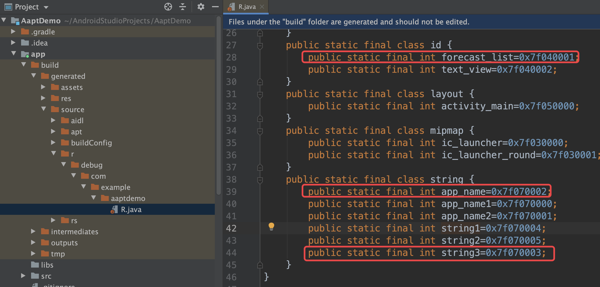
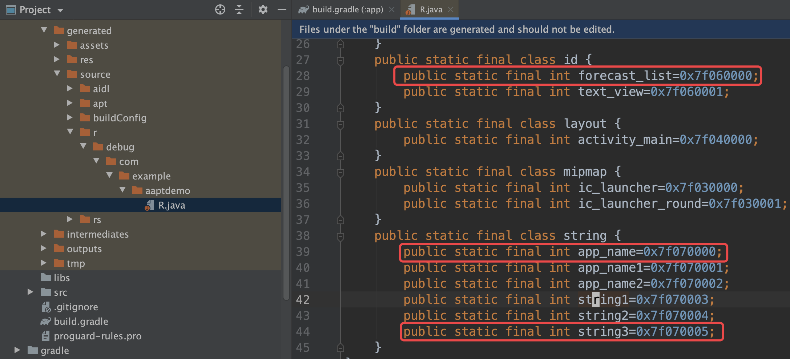
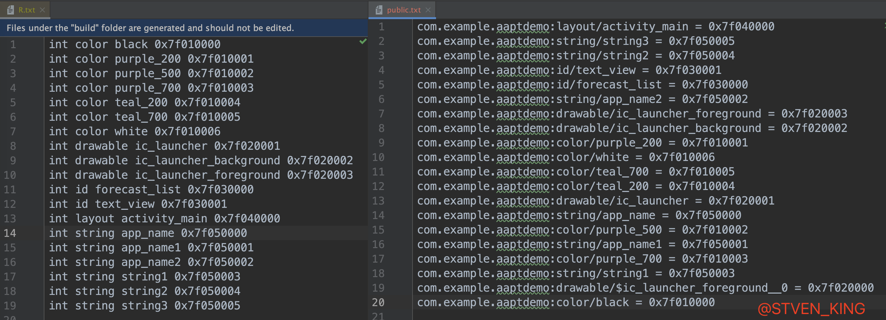
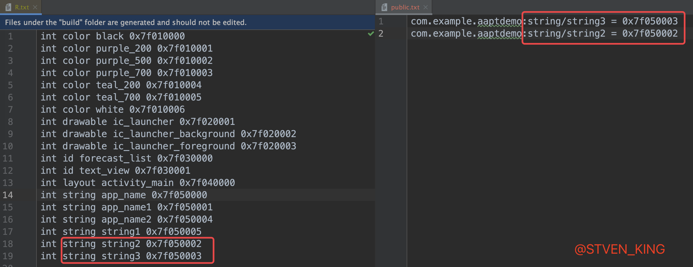
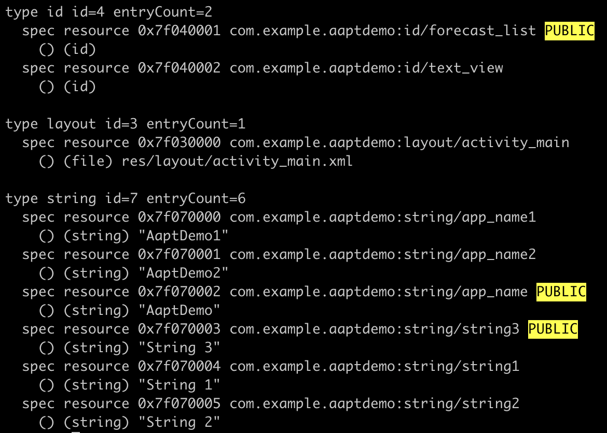

## AAPT概述

从`Android Studio 3.0`开始，`google`默认开启了`aapt2`作为资源编译的编译器，`aapt2`的出现，为资源的增量编译提供了支持。当然使用过程中也会遇到一些问题，我们可以通过在**gradle.properties**中配置**android.enableAapt2=false**来关闭`aapt2`。

### 资源

`Android` 天生为兼容各种各样不同的设备做了相当多的工作，比如屏幕大小、国际化、键盘、像素密度等等，我们能为各种各样特定的场景下使用特定的资源做兼容而不用改动一行代码，假设我们为各种各样不同的场景适配了不同的资源，如何能快速的应用上这些资源呢？`Android` 为我们提供了 `R` 这个类，指定了一个资源的索引（`id`），然后我们只需要告诉系统在不同的业务场景下，使用对应的资源就好了，至于具体是指定资源里面的哪一个具体文件，由系统根据开发者的配置决定。

在这种场景下，假设我们给定的 `id` 是 `x` 值，那么当下业务需要使用这个资源的时候，手机的状态就是 `y` 值，有了(`x,y`)，在一个表里面就能迅速的定位到资源文件的具体路径了。这个表就是 `resources.arsc`，它是从 `aapt` 编译出来的。

其实二进制的资源（比如图片）是不需要编译的，只不过这个“编译”的行为，是为了生成 `resources.arsc` 以及对 `xml` 文件进行二进制化等操作，`resources.arsc` 是上面说的表，`xml` 的二进制化是为了系统读取上性能更好。`AssetManager` 在我们调用 `R` 相关的 `id` 的时候，就会在这个表里面找到对应的文件，读取出来。

`Gradle` 在编译资源的过程中，就是调用的这些[aapt2命令](https://developer.android.com/studio/command-line/aapt2)，传的参数也在这个文档里都介绍了，只不过对开发者隐藏起了调用细节。

`aapt2` 主要分两步，一步叫 `compile`，一步叫 `link`。

创建一个空工程：只写了两个` xml`，分别是 `AndroidManifest.xml` 和 `activity_main.xml`。

### Compile

```shell
 mkdir compiled
 aapt2 compile src/main/res/layout/activity_main.xml -o compiled/
```

在 `compiled` 文件夹中，生成了` layout_activity_main.xml.flat` 这个文件，它是 `aapt2` 特有的，`aapt` 没有(`aapt`拷贝的是源文件)，`aapt2` 用它能进行增量编译。如果我们有很多的文件的话，需要依次调用 `compile` 才行，其实这里也可以使用 `–dir` 参数，只不过这个参数就没有增量编译的效果了。也就是说，当传递整个目录时，即使只有一个资源发生了变化，`AAPT2`也会重新编译目录中的所有文件。

### Link

`link` 的工作量比 `compile` 要多一点，此处的输入是多个` flat` 的文件 和 `AndroidManifest.xml`，外部资源，输出是只包含资源的 `apk` 和 `R.java`。命令如下：

```shell
aapt2 link -o out.apk \
-I $ANDROID_HOME/platforms/android-28/android.jar \
compiled/layout_activity_main.xml.flat \
--java src/main/java \
--manifest src/main/AndroidManifest.xml
```

- 第二行 `-I` 是 `import` 外部资源，此处主要是 `android` 命名空间下定义的一些属性，我们平常使用的`@android:xxx`都是放在这个` jar` 里面，其实我们也可以提供自己的资源供别人链接;
- 第三行是输入的 `flat` 文件，如果有多个，直接在后面拼接即可;
- 第四行是 `R.java` 生成的目录;
- 第五行是指定 `AndroidManifest.xml`;

`Link`完成后会生成`out.apk`和`R.java`，`out.apk`中包含了一个`resources.arsc`文件。只带资源文件的可以用后缀名`.ap_`。

### 查看编译后的资源

除了是用 `Android Studio` 去查看 `resources.arsc`，还可以直接使用 `aapt2 dump apk` 信息的方式来查看资源相关的` ID` 和状态：

```shell
aapt2 dump out.apk
```

输出的结果如下：

```shell
Binary APK
Package name=com.geminiwen.hello id=7f
  type layout id=01 entryCount=1
    resource 0x7f010000 layout/activity_main
      () (file) res/layout/activity_main.xml type=XML
```

可以看到` layout/activity_main` 对应的 `ID` 是 `0x7f010000`。

### 资源共享

`android.jar` 只是一个编译用的桩，真正执行的时候，`Android OS` 提供了一个运行时的库(`framework.jar`)。`android.jar`很像一个 `apk`，只不过它存在的是 `class` 文件，然后存在一个 `AndroidManifest.xml` 和 `resources.arsc`。这就意味着我们也可以对它用`aapt2 dump`，执行如下命令：

```shell
aapt2 dump $ANDROID_HOME/platforms/android-28/android.jar > test.out
```

得到很多类似如下的输出：

```shell
resource 0x010a0000 anim/fade_in PUBLIC
      () (file) res/anim/fade_in.xml type=XML
    resource 0x010a0001 anim/fade_out PUBLIC
      () (file) res/anim/fade_out.xml type=XML
    resource 0x010a0002 anim/slide_in_left PUBLIC
      () (file) res/anim/slide_in_left.xml type=XML
    resource 0x010a0003 anim/slide_out_right PUBLIC
      () (file) res/anim/slide_out_right.xml type=XML
```

它多了一些`PUBLIC`的字段，一个 `apk` 文件里面的资源，如果被加上这个标记的话，就能被其他 `apk` 所引用，引用方式是`@包名:类型/名字`，例如：`@android:color/red`。

如果我们想要提供我们的资源，那么首先为我们的资源打上 `PUBLIC` 的标记，然后在 `xml` 中引用你的包名，比如：`@com.gemini.app:color/red` 就能引用到你定义的 `color/red` 了，如果你不指定包名，默认是自己。

至于` AAPT2` 如何生成 `PUBLIC`，感兴趣的可以接着阅读本文。

## ids.xml概述

`ids.xml`：为应用的相关资源提供唯一的资源`id`。`id`是为了获得`xml`中的对象需要的参数，也就是 `Object = findViewById(R.id.id_name);` 中的`id_name`。

这些值可以在代码中用`android.R.id`引用到。
若在`ids.xml`中定义了**ID**，则在`layout`中可如下定义`@id/price_edit`，否则`@+id/price_edit`。

> 优点

1. 命名方便，我们可以把一些特定的控件先命好名，在使用的时候直接引用`id`即可，省去了一个命名环节。
2. 优化编译效率:
   - 添加`id`后会在`R.java`中生成;
   - 使用`ids.xml`统一管理,一次性编译即可多次使用.
     但使用`"@+id/btn_next"`的形式,每次文件保存`(Ctrl+s`)`后R.java`都会重新检测,如果存在该`id`则不生成,如果不存在就需要添加该`id`。故编译效率降低。


`ids.xml`文件内容：

```xml
<?xml version="1.0" encoding="utf-8"?>
<resources>
    <item name="forecast_list" type="id"/>
<!--    <item name="app_name" type="string" />-->
</resources>
```

也许有人很好奇上面有一行被注释的代码，打开注释会发现编译会报一下错误：

```java
Execution failed for task ':app:mergeDebugResources'.
> [string/app_name] /Users/tanzx/AndroidStudioProjects/AaptDemo/app/src/main/res/values/strings.xml	[string/app_name] /Users/tanzx/AndroidStudioProjects/AaptDemo/app/src/main/res/values/ids.xml: Error: Duplicate resources
```

因为`app_name`对于的资源已经在`value`中被声明了。

## public.xml概述

官方相关的说明[官网：选择要设为公开的资源](https://developer.android.com/studio/projects/android-library#PrivateResources)。

> 原文翻译：库中的所有资源在默认情况下均处于公开状态。如需将所有资源隐式设为私有，您必须至少将一个特定属性定义为公开。资源包括您项目的 `res/` 目录中的所有文件，例如图像。为了防止库的用户访问仅供内部使用的资源，您应该通过声明一个或多个公开资源的方式来使用这种自动私有标识机制。或者，您也可以通过添加空的 `<public />` 标记将所有资源设为私有，此标记不会将任何资源设为公开，而是会将一切（所有资源）都设为私有。
>
> 通过将属性隐式设为私有，您不仅可以防止库的用户从内部库资源获得代码补全建议，还可以重命名或移除私有资源，而不会破坏库的客户端。系统会从代码补全中过滤掉私有资源，并且 [Lint](https://developer.android.com/studio/write/lint) 会在您尝试引用私有资源时发出警告。
>
> 在构建库时，Android Gradle 插件会获取公开资源定义，并将其提取到 `public.txt` 文件中，然后系统会将此文件打包到 AAR 文件中。

实测结果也仅仅是不回代码自动不全，编译器报红。如果进行`lint`检查，编译都没有警告~！

现在大部分的解释为：文件**RES/value/public.xml**用于将固定资源 `ID` 分配给 `Android` 资源。

[stackoverfloew:What is the use of the res/values/public.xml file on Android?](https://stackoverflow.com/questions/9348614/what-is-the-use-of-the-res-values-public-xml-file-on-android%E3%80%82)

`public.xml`文件内容：

```xml
<?xml version="1.0" encoding="utf-8"?>
<resources>
    <public name="forecast_list" id="0x7f040001" type="id" />
    <public name="app_name" id="0x7f070002" type="string" />
    <public name="string3" id="0x7f070003" type="string" />
</resources>
```

## 资源id固定

资源id的固定在热修复和插件化中极其重要。在热修复中，构建`patch`时，需要保持`patch`包的资源`id`和基准包的资源`id`一致；在插件化中，如果插件需要引用宿主的资源，则需要将宿主的资源`id`进行固定，因此，资源`id`的固定在这两种场景下是尤为重要的。

在`Android Gradle Plugin 3.0.0`中，默认开启了`aapt2`，原先aapt的资源固定方式`public.xml`也将失效，必须寻找一种新的资源固定的方式，而不是简单的禁用掉`aapt`2，因此本文来探讨一下`aapt和aapt2`分别如何进行资源`id`的固定。

### `aapt`进行`id`的固定

> 项目环境配置（PS：吐槽一下aapt已经被aapt2代替了，aapt相关资料几乎没有，环境搭建太费劲了~！）
>
> `com.android.tools.build:gradle:2.2.0`
>
> `distributionUrl=https\://services.gradle.org/distributions/gradle-3.4.1-all.zip`
>
> `compileSdkVersion 24`
>
> `buildToolsVersion '24.0.0'`

先在`value`文件下按照上面的`ids.xml`和`public.xml`的内容以及文件名，生成对应的文件。

> 直接编译结果



通过直接编译之后的`R文件`的内容，可以看到我们想要的设置的资源`id`并没有按照我们预期的生成。

> 将`public.xml`文件拷贝到`build/intermediates/res/merged`对应的目录

```groovy
afterEvaluate {
    for (variant in android.applicationVariants) {
        def scope = variant.getVariantData().getScope()
        String mergeTaskName = scope.getMergeResourcesTask().name
        def mergeTask = tasks.getByName(mergeTaskName)
        mergeTask.doLast {
            copy {
                int i=0
                from(android.sourceSets.main.res.srcDirs) {
                    include 'values/public.xml'
                    rename 'public.xml', (i++ == 0? "public.xml": "public_${i}.xml")
                }
                into(mergeTask.outputDir)
            }
        }
    }
}
```



这次我们可以直接看到资源`id`按照我们需要生成了。

> 这是为什么呢？

1. `android gradle`插件`1.3`以下版本可以直接将`public.xml`放在源码`res`目录参与编译;

2. `android gradle`插件`1.3+`版本在执行`mergeResource`任务时忽略了`public.xml`，所以`merge`完成后的`build`目录下的`res`目录下没有`public.xml`相关的内容。所以需要在编译时通过脚本将`public.xml`插入到`merge`完成后的`build`目录下的`res`目录下。之所以这样做可行，是因为`aapt`本身是支持`public.xml`的，只是`gradle`插件在对资源做预处`(merge)`时对`public.xml`做了过滤。

### `aapt2`进行`id`的固定

在`aapt2`编译（将资源文件编译为二进制格式）后，发现`merge`的资源都已经经过了预编译，产生了`flat`文件，这时候将`public.xml`文件拷贝至该目录就会产生编译错误。

但在`aapt2`的**链接**阶段中，我们查看相关的**链接选项**：

| 选项                              | 说明                                                         |
| --------------------------------- | ------------------------------------------------------------ |
| `--emit-ids path`                 | 在给定的路径下生成一个文件，该文件包含资源类型的名称及其 ID 映射的列表。它适合与 `--stable-ids` 搭配使用。 |
| `--stable-ids outputfilename.ext` | 使用通过 `--emit-ids` 生成的文件，该文件包含资源类型的名称以及为其分配的 ID 的列表。此选项可以让已分配的 ID 保持稳定，即使您在链接时删除了资源或添加了新资源也是如此。 |

发现`--emit-ids`和`--stable-ids`命令搭配可以实现`id`的固定。

```groovy
android {
  aaptOptions {
        File publicTxtFile = project.rootProject.file('public.txt')
        //public文件存在，则应用，不存在则生成
        if (publicTxtFile.exists()) {
            project.logger.error "${publicTxtFile} exists, apply it."
            //aapt2添加--stable-ids参数应用
            aaptOptions.additionalParameters("--stable-ids", "${publicTxtFile}")
        } else {
            project.logger.error "${publicTxtFile} not exists, generate it."
            //aapt2添加--emit-ids参数生成
            aaptOptions.additionalParameters("--emit-ids", "${publicTxtFile}")
        }
    }
}
```

1. 第一次编译，先通过`--emit-ids`在项目的根目录生成`public.txt`;
2. 再将`public.txt`里面对于的`id`改为自己想要固定的`id`;
3. 再次编译，通过`--stable-ids`和根目录下的`public.txt`进行资源`id`的固定；

> `--emit-ids`编译结果



> 修改`public.txt`文件内容再次编译



#### R.txt转public.txt

我们一般正常打包生成的中间产物是`build/intermediates/symbols/debug/R.txt`，需要将其转化为`public.txt`。

> `R.txt`格式（`int`  ` type`  `name`  `id`）或者（`int[]`  `styleable`  `name`  `{id,id,xxxx}`）
>
> `public.txt`格式（`applicationId:type/name = id`）

所以在转化过程中需要过滤掉`R.txt`文件中的`styleable`类型。

```java
android {
    aaptOptions {
        File rFile = project.rootProject.file('R.txt')
        List<String> sortedLines = new ArrayList<>()
        // 一行一行读取
        rFile.eachLine {line ->
            //rLines.add(line)
            String[] test = line.split(" ")
            String type = test[1]
            String name = test[2]
            String idValue = test[3]
            if ("styleable" != type) {
                sortedLines.add("${applicationId}:${type}/${name} = ${idValue}")
            }
        }
        Collections.sort(sortedLines)
        File publicTxtFile = project.rootProject.file('public.txt')
        if (!publicTxtFile.exists()) {
            publicTxtFile.createNewFile()
            sortedLines?.each {
                publicTxtFile.append("${it}\n")
            }
        }
    }
}
```

## PUBLIC标记

在`AAPT概述`这部分我们讲过如果一个 `apk` 文件里面的资源，如果被加上`PUBLIC`标记的话，就能被其他 `apk` 所引用，引用方式是`@包名:类型/名字`，例如：`@android:color/red`。

阅读上面《`aapt`进行`id`的固定》到《`aapt2`进行`id`的固定》这两部分，我们知道`aapt`和`aapt2`进行`id`固定的方法是不相同的。

其实如果我们用`aapt2 dump build/intermediates/res/resources-debug.ap_`命令查看生成资源的相关信息。

`aapt`通过`public.xml`进行`id`固定的资源信息有`PUBLIC`标记：



二使用上面`aapt2`进行`id`固定的方式是没有下图中的`PUBLIC`标记的。

原因还是`aapt`和`aapt2`的差异造成的，`aapt2`的`public.txt`不等于`aapt`的`public.xml`，在`aapt2`中如果要添加`PUBLIC`标记，其实还是得另寻其他途径。

## 参考文章：

[android public.xml 用法](https://www.cnblogs.com/linghu-java/p/9548039.html)

[Android-Gradle笔记](https://ljd1996.github.io/2019/08/21/Android-Gradle%E7%AC%94%E8%AE%B0/)

[aapt2 适配之资源 id 固定](https://fucknmb.com/2017/11/15/aapt2%E9%80%82%E9%85%8D%E4%B9%8B%E8%B5%84%E6%BA%90id%E5%9B%BA%E5%AE%9A/)
